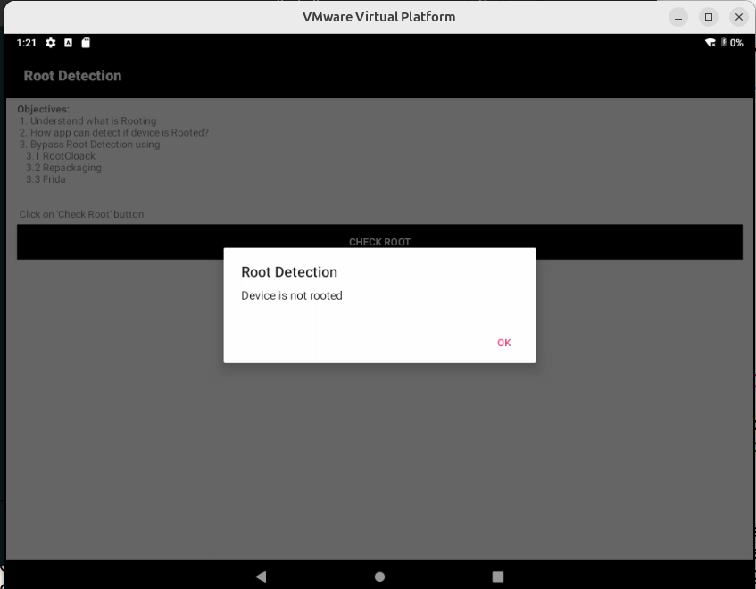
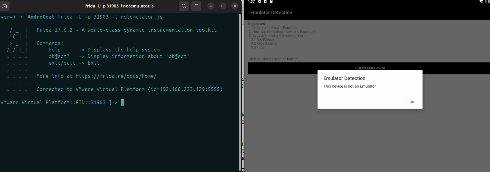
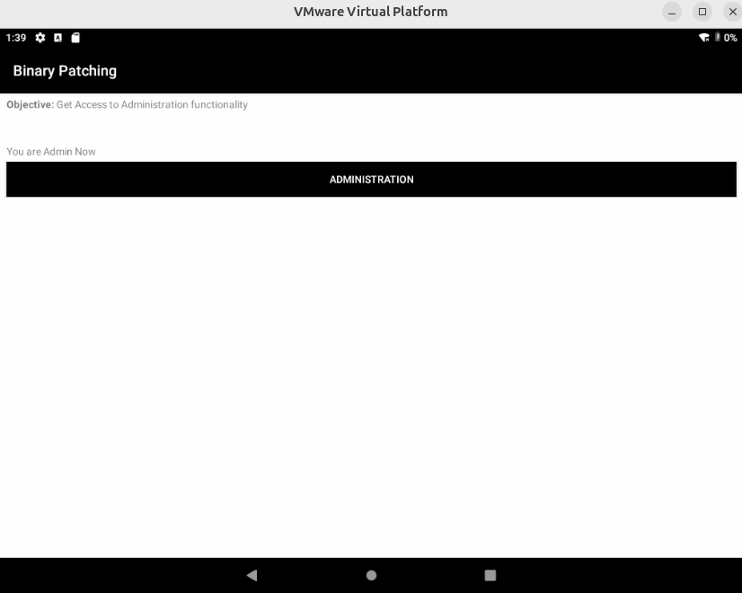
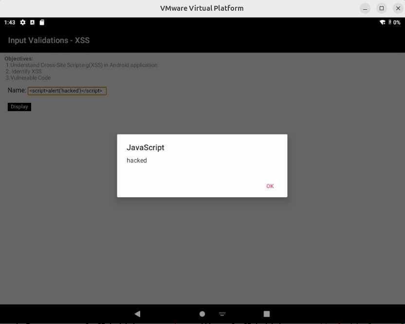
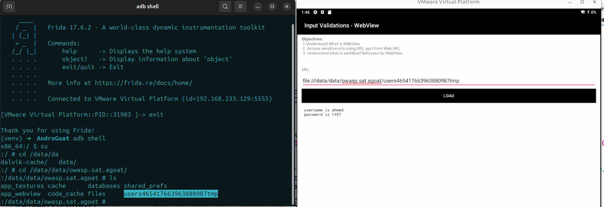
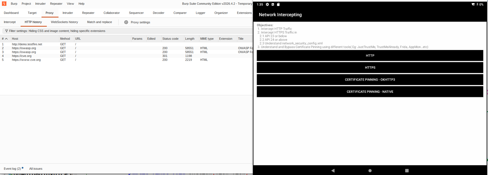
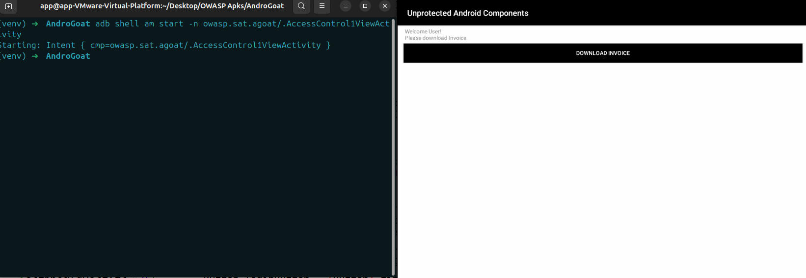
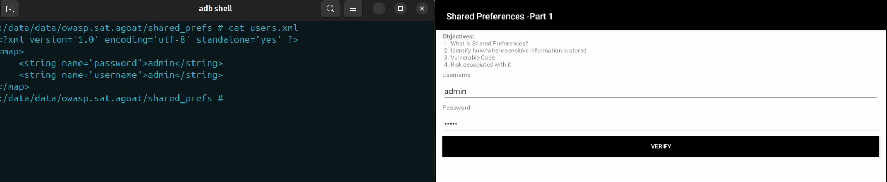
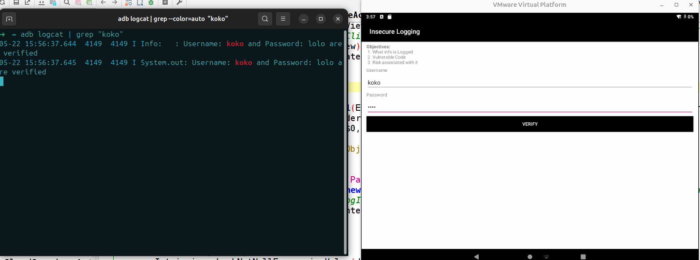

## 1- Check root

Using *jadx-gui* we discovered in *RootDetectionActivity* class function called *isRooted* -> it checks if the device is rooted or not
```java
public final boolean isRooted() {
        String[] file = {"/system/app/Superuser/Superuser.apk", "/system/app/Superuser.apk", "/sbin/su", "/system/bin/su", "/system/xbin/su", "/data/local/xbin/su", "/data/local/bin/su", "/system/sd/xbin/su", "/system/bin/failsafe/su", "/data/local/su", "/su/bin/su", "re.robv.android.xposed.installer-1.apk", "/data/app/eu.chainfire.supersu-1/base.apk"};
        boolean result = false;
        for (String files : file) {
            File f = new File(files);
            result = f.exists();
            if (result) {
                break;
            }
        }
        return result;
    }
```
If this function return true *the device is rooted* and if false *the device is not rooted*, so we need to override this function to make it return false, we can do this with decompile the apk and patching *smali* code or using *frida*

Here we will use *frida* framework
Steps:
		1- Execute *frida server* on the android device
		2- Run the apk on device to patch it in run-time with *frida*
		3- Execute this command in our machine frida -U -f \<package-name> 
		4- Write javascript code to override *isRooted* function 
```javascript
Java.perform(function()  {
  var Root = Java.use('owasp.sat.agoat.RootDetectionActivity');
  Root.isRooted.implementation = function () {
    return false;
    
  };
});
```
Now, when use check root function, we'll get *device is not rooted*


---
## 2- Check emulator
this feature in our app determine if our device is a real device or emulator, if real device we'll get *This device is an emulator*, and if emulator we'll get *This device is not an emulator*

As we did before using *jadx-gui* we searched for this activity and discovered *isEmulator* function which return true if the device is an emulator and return false if not
```java
private final boolean isEmulator() {
        String str = Build.FINGERPRINT;
        String str2 = Build.DEVICE;
        String str3 = Build.MODEL;
        String str4 = Build.BRAND;
        String str5 = Build.PRODUCT;
        String buildDetails = (str + str2 + str3 + str4 + str5 + Build.MANUFACTURER + Build.HARDWARE).toLowerCase();
        Intrinsics.checkNotNullExpressionValue(buildDetails, "this as java.lang.String).toLowerCase()");
        return StringsKt.contains$default((CharSequence) buildDetails, (CharSequence) "generic", false, 2, (Object) null) || StringsKt.contains$default((CharSequence) buildDetails, (CharSequence) EnvironmentCompat.MEDIA_UNKNOWN, false, 2, (Object) null) || StringsKt.contains$default((CharSequence) buildDetails, (CharSequence) "emulator", false, 2, (Object) null) || StringsKt.contains$default((CharSequence) buildDetails, (CharSequence) "sdk", false, 2, (Object) null) || StringsKt.contains$default((CharSequence) buildDetails, (CharSequence) "vbox", false, 2, (Object) null) || StringsKt.contains$default((CharSequence) buildDetails, (CharSequence) "genymotion", false, 2, (Object) null) || StringsKt.contains$default((CharSequence) buildDetails, (CharSequence) "x86", false, 2, (Object) null) || StringsKt.contains$default((CharSequence) buildDetails, (CharSequence) "goldfish", false, 2, (Object) null) || StringsKt.contains$default((CharSequence) buildDetails, (CharSequence) "test-keys", false, 2, (Object) null);
    }
}
```
this function above examines the device information from the *build* class and searching for known emulators-related keywords like *generic* , *sdk*, *emulator*, *genymotion* 

Also using *frida* we can override *isEmulator* function to return *false* with the same previous way
```javascript
Java.perform(function(){
 
    var emulator = Java.use('owasp.sat.agoat.EmulatorDetectionActivity');
    emulator.isEmulator.implementation= function(){
      return false;
 
    }

});
```



## 3- binary patching
This feature is allow to Administrator only and the regular user can't use it

this time we'll use android patching
		steps:
				1- Decompile our APK with apktool tool
				2- open smali folder 
				2- search for binary patching activity in smali files
				3- we got this smali code in binary patching activity
			
```
iget-boolean v2, p0, Lowasp/sat/agoat/BinaryPatchingActivity;->isAdmin:Z

    if-eqz v2, :cond_0

    .line 19
    const-string v2, "You are Admin Now"

    check-cast v2, Ljava/lang/CharSequence;

    invoke-virtual {v0, v2}, Landroid/widget/TextView;->setText(Ljava/lang/CharSequence;)V
```
in the code above if this.Admin is false it jumps to cond_0
all we need here to reverse logic in if condition to make it *if-neq v2, :cond_0* instead of *if-eqz v2, :cond_0*



## 4- Hardcoded issues
Sometimes developer forgets interesting information like credentials or something like promocode in our app hardcoded in apk

In our AndroidManifest.xml file we have an activity called *HardCodeActivity*, the developer put the promocode hardcoded in this activity
```kotlin
    private final String promoCode = "NEW2019";
```


## 5- XSS
There is an activity named *XSSActivity* which contains webview contains this function:
```
function displayContent()
{
var a=document.getElementById("name");
document.write(a.value);

}
```
The function above takes input from user and write it in html page directly without filtering which allows to execute javascript code 
```
webSettings.setJavaScriptEnabled(true);
```
The *setJavascriptEnabled* method can be used to enable the execution of JavaScript within WebViews. This leaves applications vulnerable to file-based XSS. 



## 6- WebView
It is a way to embed web content into our app 
*WebSettings* is a class containing methods which manage the settings state of WebViews. 


The *setAllowFileAccess* ,*setAllowFileAccessFromFileURLs*, and *setAllowUniversalAccessFromFileURLs* methods can be used to grant access to local files, using a file scheme URL (`file://`). However, they can be exploited by malicious scripts to access arbitrary local files that the application has access to, such as their own `/data/` folder.
```
webViewSettings.setAllowFileAccess(true);
```

In our app we have *setAllowFileAccess* which is we can access to sensetive local files through it with *file://* schema



## 7- Certificate pinning
To analyze the certificate pining we need to navigate to *network_security_config.xml* in res => xml => network_security_config.xml*

we got this
```
<?xml version="1.0" encoding="utf-8"?>
<network-security-config>
    <base-config cleartextTrafficPermitted="true">
        <trust-anchors>
            <certificates src="system"/>
            <certificates src="user"/>
        </trust-anchors>
    </base-config>
    <domain-config>
        <domain includeSubdomains="true">cve.org
        </domain>
        <pin-set expiration="2050-01-01">
            <pin digest="SHA-256">p4si93w2lTZdXU4lAa2VaonZlK406ZHmkjeAn5vXiHA=
            </pin>
            <pin digest="SHA-256">DxH4tt40L+eduF6szpY6TONlxhZhBd+pJ9wbHlQ2fuw=
            </pin>
            <pin digest="SHA-256">++MBgDH5WGvL9Bcn5Be30cRcL0f5O+NyoXuWtQdX1aI=
            </pin>
        </pin-set>
    </domain-config>
</network-security-config>
```
in this file the application accept all certificates except on *cve.org* domain include subdomains, it needs specific certificate
So, we need to bypass certificate pinning with *objection* tool

Steps:
		1- We need to install objection with this command `pip3 install objection`
		2- Using this command `objection -n <packageName> start`
	    3- Finally we use `android sslpinning disable`
	    *Objection* uses frida to hook the methods which responsible for certificate pinning and modify its logic during run-time process and make the application considers that all certificates are allowable
	    


## 8- Activity exported
There is an activity that we are not permitted to access this activity unless, Enter our PIN. despite that, this activity is exported to other apps so, we can trigger this activity with adb without verify PIN using this command `adb shell am start -n owasp.sat.agoat/.AccessControl1ViewActivity`

And there is another way that we make a small app to trigger this activity using android studio 
```java
package com.hacking.goat_poc;

import android.content.Intent;
import android.os.Bundle;

import androidx.activity.EdgeToEdge;
import androidx.appcompat.app.AppCompatActivity;

public class MainActivity extends AppCompatActivity {
    @Override
    protected void onCreate(Bundle savedInstanceState) {
        super.onCreate(savedInstanceState);

        EdgeToEdge.enable(this);
        setContentView(R.layout.activity_main);

        Intent i = new Intent();
        i.setClassName(
                "owasp.sat.agoat",
                "owasp.sat.agoat.AccessControl1ViewActivity"
        );

        startActivity(i);
        finish();
    }
}
```



## 9- Insecure data storage
### 1- Shared Preferences -Part1
In activity called "InsecureStorageSharedPrefs" we got this code
```java
public static final void onCreate$lambda$1(InsecureStorageSharedPrefs this$0, EditText $username, EditText $password, View it) {
        Intrinsics.checkNotNullParameter(this$0, "this$0");
        AlertDialog.Builder builder = new AlertDialog.Builder(this$0);
        builder.mo336setTitle("Login");
        SharedPreferences sharedPreference = this$0.getSharedPreferences("users", 0);
        SharedPreferences.Editor editor = sharedPreference.edit();
        editor.putString(ContentProviderActivity.USERNAME, $username.getText().toString());
        editor.putString("password", $password.getText().toString());
        if (editor.commit()) {
            builder.mo314setMessage("Username and Password are verified");
            Toast.makeText(this$0.getApplicationContext(), "Username and Password are verified", 1).show();
        } else {
            builder.mo314setMessage("There is an issue while verifying the username and password");
            Toast.makeText(this$0.getApplicationContext(), "There is an issue while verifying the username and password", 1).show();
        }
        builder.mo329setPositiveButton("OK", new DialogInterface.OnClickListener() { // from class: owasp.sat.agoat.InsecureStorageSharedPrefs$$ExternalSyntheticLambda0
            @Override // android.content.DialogInterface.OnClickListener
            public final void onClick(DialogInterface dialogInterface, int i) {
                InsecureStorageSharedPrefs.$r8$lambda$1fWJQgrSHHhkxcyv2jzCJwyAx40(dialogInterface, i);
            }
        });
        AlertDialog dialog = builder.create();
        Intrinsics.checkNotNullExpressionValue(dialog, "builder.create()");
        dialog.show();
    }
}
```
this function above create shared preference called *users.xml* and store the username and password that user enter and write them in the shared preference as a key and value
The problem here that store the password as a plaintext

### 2- Shared Preferences -Part 2
There is a game and to win with it we must get the score to 10000 
in the activity called *InsecureStorageSharedPrefs1Activity* there is a shared preference that stores the score and value in file called *score.xml* so, we can edit score in this file to win this game
```java
 private final int getScoreFromSP() {
        int score = 0;
        int level = 1;
        SharedPreferences sharedPreferences = getSharedPreferences("score", 0);
        if (sharedPreferences.getInt("score", 0) != 0 && sharedPreferences.getInt("level", 0) != 0) {
            score = sharedPreferences.getInt("score", 0);
            level = sharedPreferences.getInt("level", 0);
        }
        System.out.println((Object) ("Score is " + score + " and Level is " + level));
        return score;
    }
}
```
*score.xml*
```xml
<?xml version='1.0' encoding='utf-8' standalone='yes' ?>
<map>
    <int name="score" value="12001" />
    <int name="level" value="2" />
</map>

```
### 3- sqlite
There is an activity that takes username and password from the user and store these credentials in a plain text 
```java
String qry = "INSERT INTO users (username, password) VALUES('" + ((Object) text) + "','" + ((Object) $password.getText()) + "')";
```
1- Now go to `/data/data/<package name>` then, access the database with `sqlite3 <database name>`
2- show tables with `.tables`
3- `SELECT * FROM <tableName>`
### 4- Temp File
```java
try {
            File userinfo = File.createTempFile("users", "tmp", new File(this$0.getApplicationInfo().dataDir));
            userinfo.setReadable(true);
            userinfo.setWritable(true);
            FileWriter fw = new FileWriter(userinfo);
            fw.write("username is " + ((Object) $username.getText()) + "\n");
            fw.write("password is " + ((Object) $password.getText()) + "\n");
            fw.close();
            builder.mo314setMessage("Username and Password are verified");
            Toast.makeText(this$0.getApplicationContext(), "Username and Password are verified", 1).show();
        } catch (Exception e) {
            builder.mo314setMessage("There is an issue while verifying the username and password");
            Toast.makeText(this$0.getApplicationContext(), "There is an issue while verifying the username and password", 1).show();
            e.printStackTrace();
        }
```
In the code above, we created a temporary file that store user credentials but  the app stores data as a plain text in file named `users*tmp` 
### SD Card - External Storage
```java
Date date = new Date();
                Editable text = $username.getText();
                String data = "This data is stored in SdCard on " + date + ": \n Username - " + ((Object) text) + " Password -" + ((Object) $password.getText()) + "\n";
                File userinfo = File.createTempFile("users", "_tmp", this$0.getExternalFilesDir(null));
                System.out.println((Object) ("userinfo " + userinfo));
                userinfo.setReadable(true);
                userinfo.setWritable(true);
                FileWriter fw = new FileWriter(userinfo);
                fw.write(data);
                fw.close();
```
The app creates file in sdcard but we should grant storage access to app first

## 10- Side Channel Data Leakage
### 1- Insecure logging
In *InsecureLoggingActivity* has a vulnerable code that fetch the sensitive information in log of the application.
In the logcat activity logs, the details of usernames and passwords will be displayed in text.
```java
String logMessage = "Username: " + ((Object) text) + " and Password: " + ((Object) $password.getText()) + " are verified";
        Log.i("Info:", logMessage);
        System.out.println(logMessage);
```
In the code above makes the information displayed twice in logcat , the first one because *Log.i* and the second because *System.out.println*


### 2- Clipboard copy and paste
in *ClipboardActivity* there is a vulnerable code that generate OTP and copy it automatically
This is a security flaw that allows another app to access the clipboard and steal it
```java
 ClipboardManager clipboard = (ClipboardManager) systemService;
            ClipData clip = ClipData.newPlainText("CC Card", String.valueOf(otp));
            clipboard.setPrimaryClip(clip);
            builder.mo314setMessage("OTP Generated and Copied: " + otp);
```

### 3- keyboard cache
Keyboard cache is a feature where the keyboard **stores and learns what you type** to improve suggestions, autocorrect, and predictions.

#### Briefly:

It’s a memory inside the keyboard that:

- remembers commonly typed words
- suggests them later
- improves typing speed and accuracy

#### Example:

If you type “android” often, the keyboard may start suggesting it after you type “and”

In our application in *KeyboardCacheActivity* the application failing to correctly mark sensitive input fields as sensitive data.
If a password field is declared like:

```xml
<EditText ... />
```

instead of:

```xml
android:inputType="textPassword"
```

➡️ The system does NOT know this is sensitive data.